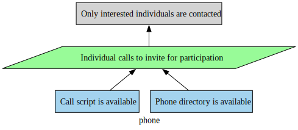
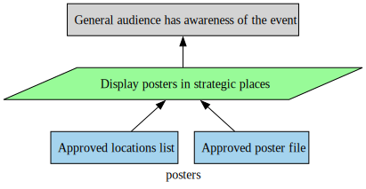
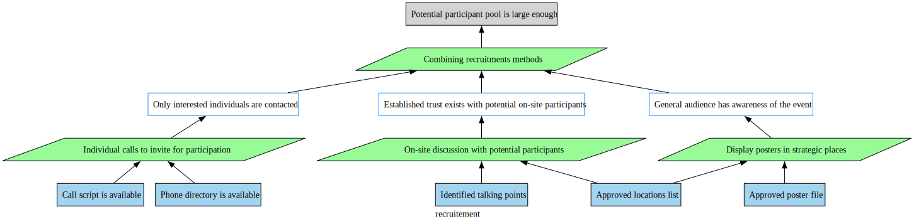
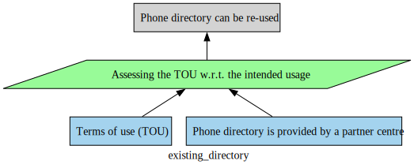
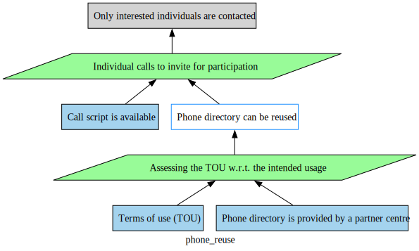
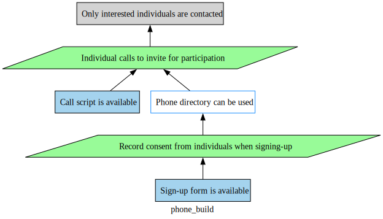
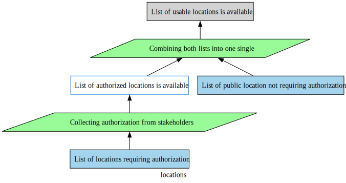
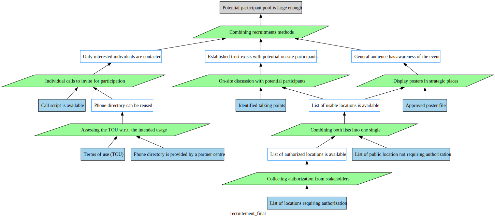

# Good practices for Older Adults

## Authors
- Shyam Ravichandran
- Denise Geisskovitck
- Sébastien Mosser
- Anne-Marie Pinna-Déry


## Justifying Practices: Recruiting Older Adults

### Off-the-shelf recruitment strategies

#### Phone

<div align="center">



</div>

#### Poster display

<div align="center">



</div>

#### On-site recruitment

<div align="center">


</div>

### Assembling a recruitment strategy

```
composition {
    justification recruitement is assemble(phone, posters, trusted) {
        conclusion: "Potential participant pool is large enough"
        strategy: "Combining recruitments methods"
    }
}
```

<div align="center">



</div>

### Refining how to access to phone numbers

#### Re-using an existing phone directory


<div align="center">



</div>

```
composition {
    justification phone_reuse is refine(phone, existing_directory) {
        hook: "phone:directory"
    }
}
```
<div align="center">



</div>


#### Building one from scratch

<div align="center">


</div>

```
composition {
    justification phone_reuse is refine(phone, existing_directory) {
        hook: "phone:directory"
    }
}
```
<div align="center">



</div>

### Refining how to access to locations

<div align="center">



</div>

### Complete justification

```
composition {

    justification recruitement is assemble(phone, posters, trusted) {
        conclusion: "Potential participant pool is large enough"
        strategy: "Combining recruitments methods"
    }

    justification temp is refine(recruitment, locations) {
        hook: "loc_available"
    }

    justification final is refine(temp, phone_reuse) {
        hook: "directory"
    }

}
```

<div align="center">



</div>


## Organizing Practices: Regular versus Remediation
